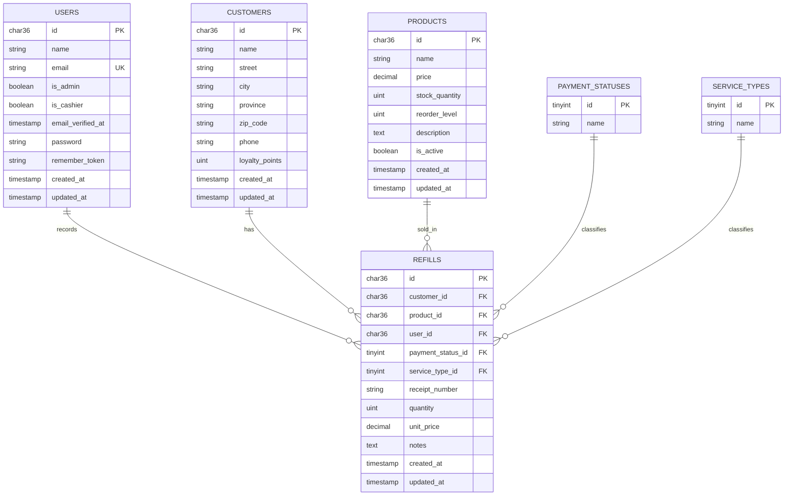

```mermaid
erDiagram
    USERS {
        char36 id PK
        string name
        string email UK
        boolean is_admin
        boolean is_cashier
        timestamp email_verified_at
        string password
        string remember_token
        timestamp created_at
        timestamp updated_at
    }

    CUSTOMERS {
        char36 id PK
        string name
        string street
        string city
        string province
        string zip_code
        string phone
        uint loyalty_points
        timestamp created_at
        timestamp updated_at
    }

    PRODUCTS {
        char36 id PK
        string name
        decimal price
        uint stock_quantity
        uint reorder_level
        text description
        boolean is_active
        timestamp created_at
        timestamp updated_at
    }

    PAYMENT_STATUSES {
        tinyint id PK
        string name
    }

    SERVICE_TYPES {
        tinyint id PK
        string name
    }

    REFILLS {
        char36 id PK
        char36 customer_id FK
        char36 product_id FK
        char36 user_id FK
        tinyint payment_status_id FK
        tinyint service_type_id FK
        string receipt_number
        uint quantity
        decimal unit_price
        text notes
        timestamp created_at
        timestamp updated_at
    }

    USERS ||--o{ REFILLS : records
    CUSTOMERS ||--o{ REFILLS : has
    PRODUCTS ||--o{ REFILLS : sold_in
    PAYMENT_STATUSES ||--o{ REFILLS : classifies
    SERVICE_TYPES ||--o{ REFILLS : classifies
```
